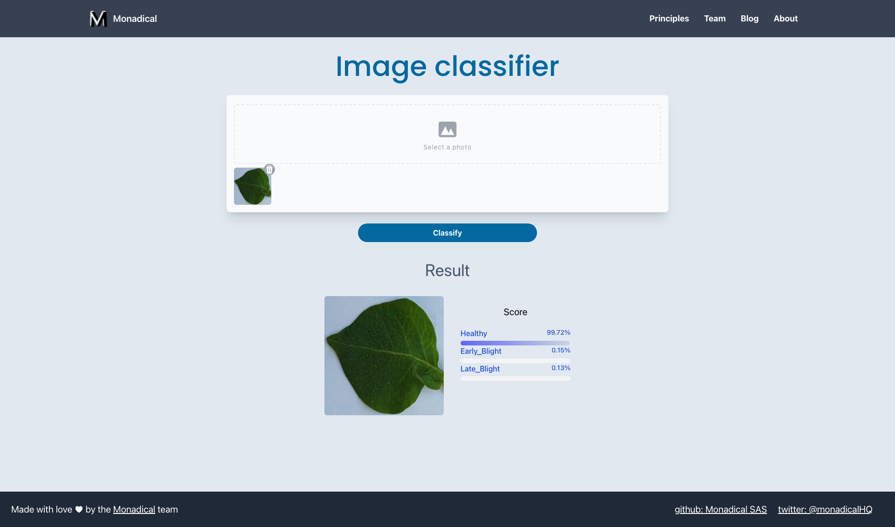

# ML-take-home
Template for Machine Learning take home project


## Description

The purpose of this project is to implement an image classifier that allows to determine the health status of a potato plant according to the state of its leaves. The idea is that **using a dataset that you can find in this repository you must do the following**:

 - Train an image classification model. You can use a Jupyter notebook but the code must also go in the `train.py` file. 
 - Implement the necessary changes in the frontend(if it's required) that allows you to upload an image and by means of the classifier, determine the health status of the plant/leaves. 
 - Implement  the necessary changes in the  REST API which run the machine learning model. 

The project already runs a model trained (you can download it from [here]()) with this dataset, so that you can visualize how it works. For the training we used HuggingFace Transformers but you are free to select the tool you want to work with.

The dataset contains a set of images separated into three folders according to their classification (`Healthy`,`Early Blight`,`Late Blight`) and in turn they are divided into three folders `Training`, `Testing` and `Validation`. For example:

**Healthy**


**Early Blight**


**Late Blight**


With the frontend you can upload an image and get its classification using the trained machine learning model:



## Structure

The project has three implementations: Frontend, Backend and Machine Learning tasks. Therefore it has two folders for that purpose:

 - **ml-client**. It contains all related with the frontend.
 - **ml-server**. It contains all related with the backend service and machine learning pipeline

 ### Frontend

 The frontend was implemented using React with Typescript and Tailwind as CSS framework. Basically it has the following structure:

 ```
├── README.md
├── package-lock.json
├── package.json
├── postcss.config.js
├── public
│   ├── ...
├── src
│   ├── App.css
│   ├── App.test.tsx
│   ├── App.tsx
│   ├── components
│   │   ├── Classifier
│   │   │   └── Classifier.tsx
│   │   ├── Footer
│   │   │   └── Footer.tsx
│   │   ├── ImageLoader
│   │   │   ├── ImageLoader.tsx
│   │   │   └── ImageResult.tsx
│   │   └── Navbar
│   │       └── NavBar.tsx
│   ├── index.css
│   ├── index.tsx
│   ├── logo.svg
│   ├── react-app-env.d.ts
│   ├── reportWebVitals.ts
│   └── setupTests.ts
├── tailwind.config.js
└── tsconfig.json
 ```

You probably don't need to modify anything in the frontend but you are free to add new functionalities or implement a new one in case you need it.

 ### Backend

REST API implemented with FastAPI with which you can expose the Machine Learning service for image classification. It consists of the following:

```
ml-server/
├── Pipfile
├── README.md
├── app
│   ├── app.py
│   ├── models
│   │   ├── response.py
│   │   └── schemas
│   │       └── classifier.py
│   ├── services
│   │   └── classifier.py
│   └── utils
│       └── strings.py
├── main.py
├── mlmodels
├── run.sh
├── tests
│   ├── conftest.py
│   └── test_base.py
└── train.py
```

- `train.py`: file that must contain everything related to the training of the machine learning model. 
- `main.py`. To execute the API and expose the service
- `mlmodels/`. To store the trained machine learning model. The api must load the model from this path.
- `tests/`. To test the api
- `app/`. Contains all the structure of the api.This app follows an N-layer structure where the direct interaction/inference with the Machine learning model is done in the `service/` layer. 

Some observations:

- You are free to choose the tool for training: Tensorflow, Pytorch, Keras, Transformers. However, we recommend you to use this model `google/vit-base-patch16-224-in21k`, in order to start from a pre-trained network and to be able to do transfer-learning.
- For training you can make use of google collaboratory which allows you to make use of a gpu machine in case you don't have one. In that case, we recommend you to upload the notebook as well as to structure well its content so you can copy and paste it into the train.py file. The idea is that the training can be done through this script for further training.
- You can add additional files to the REST API to complete your implementation,especially if you use a tool other than transformers. You will probably need to adapt it to the server


