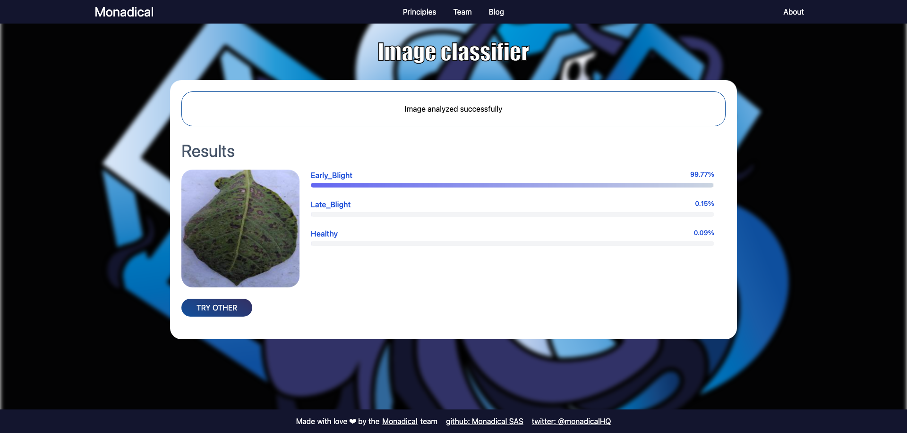

# ML Take Home

Template for Machine Learning take home project.
This project is a full stack implementation around a machine learning model to image classification.
It offers the user the possibility to test the model by uploading an image, getting the classification result, and
displaying both the image and the results in a friendly way.

## Take Home

This repository is intended to serve as a basis for the implementation of an image classifier system.  
The resulting system will allow to determine the health status of a potato plant according to the state of its leaves.
To do so, the applicant must complete the following tasks:

### Mandatory Tasks

- [ ] select a machine learning model to classify images
- we recommend you to use the `google/vit-base-patch16-224-in21k` model (it'll automatically be downloaded when you run
  the `main.py` script), but you are free to use any other model you want
- [ ] fine-tune the selected model on [the provided dataset](./dataset) so that it can classify potatoes health status
- write the resulting code in the `train.py` file
- save the resulting model in the `mlmodels` folder
- update the `classifier.py` service to load the model if required
- [ ] use the fine-tuned model to classify potatoes leaves
- [ ] run the backend tests and make sure they pass

### Optional tasks

- [ ] allow to upload and analyze multiple images at once
- [ ] dockerize the application
- [ ] deploy the application in a cloud provider
- [ ] add a new ML functionality to the application

## Dataset

The dataset contains a set of images separated into three folders according to their classification (`Healthy`
,`Early Blight`,`Late Blight`) and in turn they are divided into three folders `Training`, `Testing` and `Validation`.
For example:

**Healthy**

**Early Blight**

**Late Blight**

## Using the client

With the frontend you can upload an image and get its classification using the trained machine learning model.
The final results should look something like this:

**upload the image**

**classification results**

## Project Structure

This project consists of a python backend to expose the machine learning services and a React client to consume them.
The project structure is as follows:

- [**ml-client**](./ml-client): Frontend implementation and docs.
- [**ml-server**](./ml-server): Backend implementation and docs.

## Some observations:

- For the training we used HuggingFace Transformers, but you are free to select the tool you want to work with:
  Tensorflow, Pytorch, Keras, Transformers.
- We recommend you to use the `google/vit-base-patch16-224-in21k` model or similar, in order to start from a pre-trained
  network and to be able to do transfer-learning.
- You can make use of google collaboratory for training the model in case you don't have GPU power and require it. In
  that case, we recommend you to upload the notebook in a separate file and to move the equivalent python code into
  the `train.py`file.
- You can add additional files to the REST API to complete your implementation if required, especially if you use a tool
  other than transformers. You will probably need to adapt it to the server

