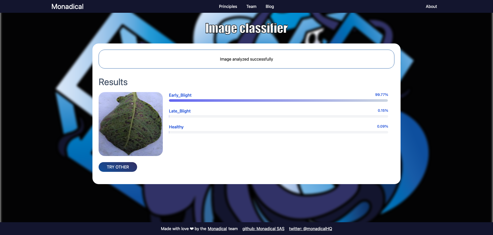

# ML Take Home - client

React client application for the ML Take Home project.  
This client is implemented using React with Typescript, TailwindCSS, and Sass.  
This application offers a basic user interface to test a model that classifies images. The process is as follows:

* the user uploads an image into a form
* the user press the classify button
* the app will connect with the server to classify the image
* the app will display the result sent by the server

## Upload Image


## Classification Results



Please make sure to have the backend server running at [https://localhost:8081/](https://localhost:8081/) before
starting the client.

## Project Structure

The project has the following structure:

 ```
.
├── README.md
├── package-lock.json
├── package.json
├── postcss.config.js
├── public
│   ├── ...
├── src
│   ├── App.test.tsx
│   ├── App.tsx
│   ├── components
│   │   ├── Classifier
│   │   │   ├── Classifier.tsx
│   │   │   └── classifier.scss
│   │   ├── Footer
│   │   │   ├── Footer.tsx
│   │   │   └── footer.scss
│   │   ├── ImageLoader
│   │   │   ├── ImageLoader.tsx
│   │   │   └── imageLoader.scss
│   │   ├── Loader
│   │   │   ├── Loader.tsx
│   │   │   └── loader.scss
│   │   ├── MainContainer
│   │   │   ├── MainContainer.tsx
│   │   │   └── mainContainer.scss
│   │   ├── Navbar
│   │   │   ├── Navbar.tsx
│   │   │   └── navbar.scss
│   │   └── Results
│   │       ├── Results.tsx
│   │       └── results.scss
│   ├── index.scss
│   ├── index.tsx
│   ├── logo.svg
│   ├── react-app-env.d.ts
│   ├── reportWebVitals.ts
│   ├── setupTests.ts
│   └── styles
│       ├── _buttons.scss
│       ├── _colors.scss
│       └── globals.scss
├── tailwind.config.js
└── tsconfig.json
 ```

You probably don't need to modify anything in the frontend, but you are free to add new functionalities or implement a
new one in case you need it.

## Create React App

This project was bootstrapped with [Create React App](https://github.com/facebook/create-react-app).

## Available Scripts

In the project directory, you can run:

### `npm start`

Runs the app in the development mode.\
Open [http://localhost:3000](http://localhost:3000) to view it in the browser.

The page will reload if you make edits.\
You will also see any lint errors in the console.

### `npm test`

Launches the test runner in the interactive watch mode.\
See the section about [running tests](https://facebook.github.io/create-react-app/docs/running-tests) for more
information.

### `npm run build`

Builds the app for production to the `build` folder.\
It correctly bundles React in production mode and optimizes the build for the best performance.

The build is minified and the filenames include the hashes.\
Your app is ready to be deployed!

See the section about [deployment](https://facebook.github.io/create-react-app/docs/deployment) for more information.

### `npm run eject`

**Note: this is a one-way operation. Once you `eject`, you can’t go back!**

If you aren’t satisfied with the build tool and configuration choices, you can `eject` at any time. This command will
remove the single build dependency from your project.

Instead, it will copy all the configuration files and the transitive dependencies (webpack, Babel, ESLint, etc) right
into your project so you have full control over them. All of the commands except `eject` will still work, but they will
point to the copied scripts so you can tweak them. At this point you’re on your own.

You don’t have to ever use `eject`. The curated feature set is suitable for small and middle deployments, and you
shouldn’t feel obligated to use this feature. However we understand that this tool wouldn’t be useful if you couldn’t
customize it when you are ready for it.

## Learn More

You can learn more in
the [Create React App documentation](https://facebook.github.io/create-react-app/docs/getting-started).

To learn React, check out the [React documentation](https://reactjs.org/).
